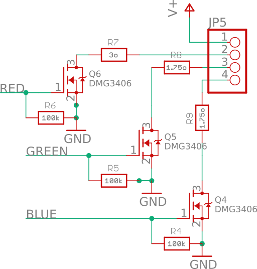
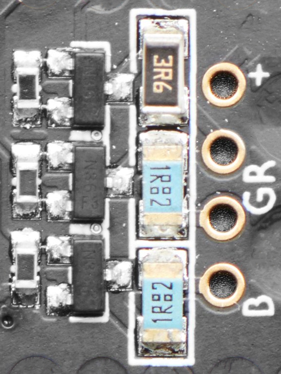
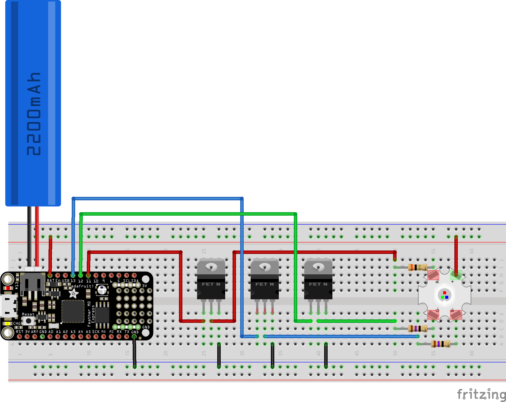

3W RGB LED hookup guide
=======================

This page covers hooking up the Adafruit [3W RGB common anode LED](https://www.adafruit.com/product/2530). Most devices, that sites like Adafruit and Sparkfun supply, can simply be powered directly from the MCU board that you're using in your project. However the 3W RGB LED is rather more complex to deal with as it draws significantly more power than an MCU board can supply.

TLDR; just jump to the breadboard diagram shown and set up the circuit shown making sure to use resistors with a suitable power rating.

---

Normally Adafruit has excellent hookup guides for all its parts, however all the guides for the 3W RGB LED involve using the [Prop-Maker FeatherWing](https://www.adafruit.com/product/3988) (which includes various other features, such as an amplifier and accelerometer). This "Wing" is designed to fit together with one of their [Feather series boards](https://www.adafruit.com/category/835). So it's not so clear how to hookup the 3W RGB LED directly to any arbitrary MCU board.

However the schematics etc. (as with all Adafruit boards) are available on GitHub. The EagleCAD files are [here](https://github.com/adafruit/Adafruit-Prop-Maker-FeatherWing-PCB). I opened the schematic in EagleCAD, converted it to an SVG with [eagle2svg](http://eagle.autodesk.com/eagle/ulp?q[title_or_author_or_description_cont]=svg) (an Eagle ULP to covert schematics to SVG) and cut out the part of the schematic that supports connecting a 3W RGB LED. The result can be seen below.

The Prop-Maker FeatherWing uses a very simple circuit for controlling a 3W RGB LED. The 3 wires marked red, green and blue (on the left of the diagram) should be connected to PWM pins on your MCU board, the wire labeled V+ should be connected directly to your power source, typically a 3.7V LiPo battery (like [this](https://www.adafruit.com/product/1781)) and the four pads of your 3W RGB LED should be connected to the terminal marked as JP5 (1 to the LED's + terminal, 2 to R-, 3 to G- and 4 to B-).

The circuit itself just of a 100k&ohm; pull-down resistor for each PWM input followed by a [DMG3406](https://www.mouser.ch/ProductDetail/621-DMG3406L-7) MOSFET and a limiting resistor for the particular LED color that it controls. If you look at the [datasheet](https://cdn-shop.adafruit.com/product-files/2530/FD-3RGB-Y2.pdf) for the RGB LED you'll see that the forward voltage for red is 2.5V while it's 3.6V for green and blue, hence the different limiting resistors - 3&ohm; for red and 1.75&ohm; for green and blue.

As you can see in the schematic, the pull-down resistors are marked as 0603 and the limiting resistors are marked as 1206 - 0603 resistors are usually 0.1W and 1206 resistors are usually 0.25W (see [resistor sizes and packages](http://www.resistorguide.com/resistor-sizes-and-packages/)). 0.1W is fine for the 100k&ohm pull-down resistors and 0.25W is fine for the 1.75&ohm; blue and green limiting resistors but the red limiting resistor is probably 0.5W (see down below for more details).

If you look at the [Prop-Maker FeatherWing guide](https://learn.adafruit.com/adafruit-prop-maker-featherwing?view=all) you can clearly see this circuit in the guide's hi-resolution image of the top of the board:

The pull-down resistors are to the left, then the three pin MOSFETs, then the larger limiting resistors and finally pads for connecting the 3W RGB LED.

If you look at the [complete schematic](https://learn.adafruit.com/assets/69243) and the [logic pins section](https://learn.adafruit.com/adafruit-prop-maker-featherwing?view=all#logic-pins-2-5) of the guide, it's clear that you just connect the PWM inputs directly to pins on your MCU while V+ is connected either directly to your battery or to a pin on your MCU that provides the battery voltage directly (you should **not** attempt to power it off one of the logic pins on your MCU board, these can typically supply at most 40mA and will burn out trying to power a circuit like this).

Creating the 3W LED driver circuit with through-hole components
---------------------------------------------------------------

So as we can see the necessary circuit is very simple. Now let's look at how to reproduce it on a breadboard.

The following two Adafruit guides provided all the information needed to produce the circuit below:

* [Adafruit transistors 101](https://learn.adafruit.com/transistors-101?view=all) - in particular see the FETs section, the "How do I pick a transistor for the job?" section and the "Driving a LED Strip" example (using Darlington transistors).
* The usage section of the [RGB LED strips guide](https://learn.adafruit.com/rgb-led-strips?view=all#usage) - the examples here are better as they show using MOSFETs ([IRLB8721](https://www.adafruit.com/product/355)) as well as Darlington transistors ([TIP120](https://www.adafruit.com/product/976)).

The [Fritzing](https://fritzing.org/home/) file for this circuit is [here](3w-rgb-led-circuit.fzz).

Note: in the diagram above the 3W RGB LED is shown as if it were a breadboardable component (with pins on the underside corresponding to the pads seen on the top). In reality you'd have to solder the resistors directly to each pad (or solder on jumper wires).

This circuit uses a 3.7V battery.

**Important:** when using 3.7V it's fine to use normal 0.25W resistors for the 1.75&ohm; limiting resistors for green and blue but you'll need to use a higher power 0.5W resistor for the 3&ohm; limiting resistor for red (see below for more details).

TODO: that post says you should use a 1W resistor for the red and 1/2W resistors for green and blue. So 5V is obviously higher than 3.7V but still this is quite a step up from the 1/4W resistors used on the Prop-Maker FeatherWing. Do you really need such high Wattage resistors and do I need higher than 1/4W resistors for my breadboard layout?

TODO: this circuit is essentially the same as the MOSFET example in the [RGB LED strips guide](https://learn.adafruit.com/rgb-led-strips?view=all#usage). Like that example, I don't use pull-down resistors on the PWM pins. Why does the Prop-Maker FeatherWing include them?

Using Darlington transistors
----------------------------

Instead of the MOSFETs you could use Darlington transistors (like this [TIP120 3 pack](https://www.adafruit.com/product/976) from Adafruit). These are cheaper but far less efficient and the voltage drop across them is significant (which is a noticeable issue here when using a 3.7V power source but less so when using 5V).

While Darlington transistors are less efficient you can get eight of them bundled up in a very convenient breadboardable DIP chip - the [ULN2803](https://www.adafruit.com/product/970) (which, at $2 from Adafruit or $1.20 from Mouser or Digikey, is very cheap as well as convenient).

TODO: circuit with ULN2803 - work out suitable resistors - the voltage drop of the ULN2803 depends on the current so wire it up the same resistors as with the MOSFETs, work out the actual voltage seen by the LED and the limiting resistors and work out proper limiting resistor value for this setup. See how hot the ULN2803 gets.

**Question:** if you can get Darlington transistors in a convenient DIP format then can't you also get MOSFETs in a similar format?

The short answer is **no**.

The ULN2803 has been around forever and continues to be produced. The DIP format is very convenient for hobbyists to work with. However the world that drives the development of components has moved to SMD and in this world people are happy, as with the Prop-Maker FeatherWing, to use individual SMD MOSFETs as all the hard work (with the fiddly work of placing them being handled by [pick-and-place machines](https://en.wikipedia.org/wiki/Pick-and-place_machine).

You can buy what are called LED driver chips (the kind of thing that's used in a typical LED lightbulb) however most of these are SMD. There are a few LED drivers in DIP format, like the TI [TLC59211IN](https://www.mouser.ch/ProductDetail/595-TLC59211IN) that use [DMOS](https://en.wikipedia.org/wiki/Power_MOSFET), i.e. MOSFETs. But these can't sink more than 200mA per output which is significantly less than the 350mA needed for the 3W RGB LED. If you could get 200mA through-hole LEDs this might still be an interesting chip to use in projects - however 20mA seems to be the limit for commonly available through-hole LEDs (you can find higher current ones but for the ones I found the higher current, for whatever reason, doesn't seem to translate to an interesting increase in lumens).

TODO: are there through-hole 200mA LEDs anywhere that do produce a significant numbers of lumens, e.g. in the 10+ lumens range?

Alternatives
------------

The 3W RGB LED is US$3 and the MOSFETs and resistors add additional cost (the MOSFETs are $1.75 each from Adafruit but considerably cheaper at $0.85 from e.g. [Digikey](https://www.digikey.com/products/en?keywords=IRLB8721PBF) or [Mouser](https://www.mouser.com/ProductDetail/942-IRLB8721PBF)). And the resistors will have to be ordered from somewhere like Mourser or Digikey as these low Ohm resistors aren't carried by hobbyist sites like Adafruit or Sparkfun.

So this comes to a minimum of $3 + (3 x $0.85) + (3 x $0.10) = $5.85 (not including postage). You're not far off the $10 cost of the Prop-Maker FeatherWing (especially when you factor in your time and effort as a cost).

Another alternative is the [Adafruit Pixie](https://www.adafruit.com/product/2741) a 3W smart pixel with all necessary components built-in. At $15, it's considerably more expensive than building the circuit above but you save assembly time and the Pixie has additional useful features such as temperature cut-off.

Resistors for different voltages
--------------------------------

The circuits above assume you're using a 3.7V LiPo battery to power things.

Alternatively you could use achive a similar voltage with a [3 x AA battery holder](https://www.adafruit.com/product/3287) and standard NiMH rechargeable AA batteries (giving a nominal voltage of 3.6V). If you use standard non-rechargeable alkaline AA batteries then you can't get quite so close to the 3.7V of a LiPo - if you use the 3 x battery holder with alkalines this will give you a nominal voltage of about 4.5V and if you use a [2 x AA battery holder](https://www.adafruit.com/product/4193) then this will give you a nominal voltage of just 3V.

Most MCU boards can also be power via USB using a 5V power adapter. The power consumption of both the the MCU board and a 3W RGB LED is greater than the 500mA that the USB ports of your average laptop or PC can deliver and the 1A delivered by the some USB power adapters. So you should use a power adapter that can deliver at least 2A (something like this [one](https://www.adafruit.com/product/1995) from Adafruit - US plug only - that delivers 2.5A).

If you get rid of the LiPo battery in the main MOSFET circuit above and use such a 5V power adapter instead then you'll also need different resistors.

Both the Adafruit ["All about LEDs"](https://learn.adafruit.com/all-about-leds?view=all) page and the more specific Sparkfun ["LED current limiting resistors"] page cover what you need to know to calculate the resistor values.

The important thing is the equation _R = (Vs - Vf) / i_ where _i_ is forward current, _Vf_ is forward voltage _Vs_ is supply voltage and _R_ is the resistance that we're solving for.

If we look at the [datasheet](https://cdn-shop.adafruit.com/product-files/2530/FD-3RGB-Y2.pdf) for the 3W RGB LED we can see that _i_ is 350mA and _Vf_ is 2.5V for red and 3.6V for green and blue.

So if _Vs_ is 5V, e.g. a USB power adapter, then the resistences we need are:

* Red = (5 - 2.5) / 0.35 = 7.14&ohm; (the nearest standard resistor is 7.5&ohm;).
* Green = (5 - 3.6) / 0.35 = 4&ohm;.
* Blue = 4&ohm; (the same as blue).

**Important:** when using 5V you can't use normal 0.25W resistors for these limiting resistors. You'll need a resistor with a 1W power rating for red and 0.5W for blue and green (see below for more details).

This corresponds, as you'd expect, with this values Rick from Adafruit Support quotes in this [forum answer](https://forums.adafruit.com/viewtopic.php?f=47&t=79083#p400741).

If we change _Vs_ to 3.7V, e.g. a LiPo battery, then we get:

* Red = (3.7 - 2.5) / 0.35 = 3.4&ohm;.
* Green/blue = (3.7 - 3.6) / 0.35 = 0.3&ohm;.

These values are quite different from the 3&ohm; and 1.75&ohm; resistors used in the Prop-Maker FeatherWing (and it's not a availability issues - you can get SMD resistors corresponding exactly to 3.4&ohm; and 0.3&ohm;).

**TODO:** you can calculate the implied supply voltage, given the limiting resistor value, using _Vs = iR + Vf_. If you use 3&ohm; and 1.75&ohm; you get:

* Red = 0.35 * 3 + 2.5 = 3.6V
* Green/blue = 0.35 * 1.75 + 3.6 = 4.2V

So these values are different and don't even imply some consistent voltage other than 3.7V. **What's going on here?**

If you're using alkalines batteries then it's left as an exercise to calculate suitable values for them.

Resistor power rating
---------------------

The resistors that you use in most simple electronics projects are 0.25W resistors (like those in the [Sparkfun resistor kit](https://www.sparkfun.com/products/10969) or those in the Adafruit [resistor category](https://www.adafruit.com/category/837)). However in this situation were dealing with rather more power than usual so we need a higher wattage for red when using a 3.7V LiPo and higher wattage resistors for all colors when using 5V.

Each color in our 3W RGB LED draws 350mA. The voltage drop across red is 2.5V (see _Vf_) above and 3.6V for green and blue.

If we're using a 5V power source this means the voltage drop is (5 - 2.5) = 2.5V for red and (5 - 3.6) = 1.4V for green and blue.

So as _W = VI_ (power = voltage * current) then we get:

* Red = 2.5 * 0.35 = 0.875W
* Green/blue = 1.4 * 0.35 = 0.49W

So we need a 1W resistor for red and 0.5W resistors for green and blue.

If we're using a 3.7V power source then we get:

* Red = (3.7 - 2.5) * 0.35 = 0.42W
* Green/blue = (3.7 - 3.6) * 0.35 = 0.035W

So we need a 0.5W resistor for red and a normal 0.25W resistor for green and blue.

Are these 3W RGB LEDs really that bright?
-----------------------------------------

So how do these 3W RGB LEDs compare with the brightest of the usual through-hole LEDs? It turns out it all depends what you mean by bright!

If you look at the Adafruit product description for their 3W RGB LED you'll see:

> Each of the red, green, and blue dice can handle continuous ~350mA current draw (with peaks of 1000mA). The light output is 110 lumens (110,000 millicandela) total.

So the combined current draw of the three colors is around 1A and the total light output is about 110lm which Adafruit say is equivalent to 110cd.

However converting from lumens to candela isn't a simple one-to-one conversion as Adafruit seem to suggest. It depends on what's called the apex angle and the conversion is only one-to-one if the apex angle is ~65.5&deg;. However according to the LED's datasheet its apex angle is 120&deg; - so 110lm and an apex angle of 120&deg; converts to just 35cd (see the RapidTables [lumens-to-candela calculator](https://www.rapidtables.com/calc/light/lumen-to-candela-calculator.html)).

If you then look at the product page for the Adafruit [super-bright white 5mm LED](https://www.adafruit.com/product/754) you can see:

> * 15,000 mcd minimum brightness
> * Viewing Angle : +/-12 degrees
> * Maximum continuous current: 20 mA

They say you get 15cd minimum _brightness_ and that for just 20mA.  So it seems like just 3 of these will achieve more brightness than the 3W RGB LED and for only 60mA in total (which an MCU board can deliver directly without requiring MOSFETs etc.).

So what's going on here? It turns out that when engineers talk about lumens and candella, they're talking about intensity and light output in a far more precise manner than when people use the word "brightness" in everyday language. For us, it's generally not really useful to compare one candela value with another if you don't also talk about the apex angle. If you're just interested in the total amount of light output by the LED then it's more useful to talk in terms of lumens. So instead of converting things to candela, as above, let's convert to lumens.

The 15cd and an apex angle of 24&deg; (2 x 12&deg;) for the super-bright white 5mm LED, converts to just 2lm (see the RapidTables [candela-to-lumens calculator](https://www.rapidtables.com/calc/light/candela-to-lumen-calculator.html)).

So the total light output of the 3W RGB LED, with its 110lm, is 55 times that of the brightest of Adafruit's through hole LED - that sounds a bit more impressive.

For much more on the relationship between candela and lumens see CompuPhase's [Candela, Lumen, Lux: the equations](https://www.compuphase.com/electronics/candela_lumen.htm). In short you can sum it up as follows. The total light output of a laser pointer is fairly low but the light it does output is very focused - the intensity of this light is very high but it just lights up a tiny point. So a laser pointer has a very high candela value but a low lumens value. In contrast a light bulb outputs a lot of light but in all directions (unlike the focused beam of a laser pointer) so it lights up a whole room but the light isn't very intense. So a light bulb has a far higher lumens value but a relatively low candela value.

If you look at Mouser or Digikey you can find 20mA white LEDs (like [this](https://www.mouser.ch/ProductDetail/941-C503DWANCCBEB152)) that go up to 48cd and red LEDs, which for whatever reason are produced with much higher candela values than blue or green LEDs, (like [this](https://www.mouser.ch/ProductDetail/78-VLCS5830)) that go up to 65cd. However if you look at such products you'll see that their apex angles are tiny. For standard 20mA LEDs the higher the candela value the lower the apex angle and once you take this into account you can see that all such LEDs tend to produce much the same light output - around 1 or 2lm.

TODO: it seems to me that viewing angle and apex angle are equivalent - is this definitely correct?

---

Misc
----

* [1/4W 1.8&ohm; resistor](https://www.digikey.com/product-detail/en/yageo/CFR-25JB-52-1R8/1.8QBK-ND/154) - $0.10 - 1.8&ohm; is as close as you can get to 1.75&ohm; for through-hole resistors.

* [1/4W 3&ohm; resistor](https://www.digikey.com/product-detail/en/yageo/CFR-25JB-52-3R/3.0QBK-ND/1440) - $0.10

* [Sparkfun 1/4 Watt resistor kit](https://www.sparkfun.com/products/10969)

* ULN2803A at [Adafruit](https://www.adafruit.com/product/970) / at [Mouser](https://www.mouser.ch/ProductDetail/511-ULN2803A)
