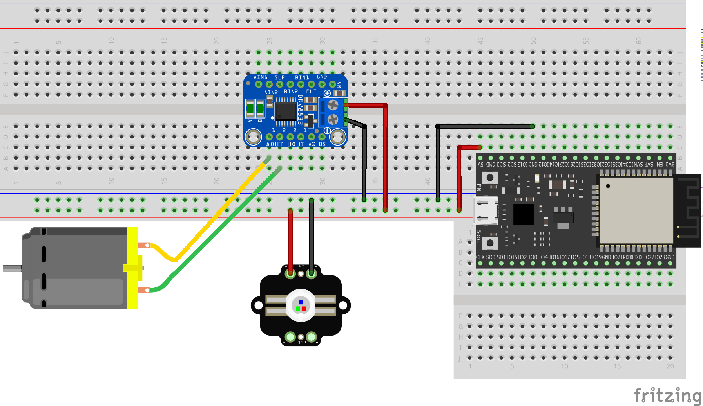

Lighthouse light mark 2
=======================

This project covers a mechanical alternative to my earlier [lighthouse light project](https://github.com/george-hawkins/lighthouse-light).

The [Fritzing](https://fritzing.org/home/) file for this circuit is [here](mains-powered-circuit.fzz).

Note: the Fritzing part for the ESP32-DevKitC was created by Hideaki Tominaga and can be found [here](https://ht-deko.com/delphiforum/?vasthtmlaction=viewtopic&t=1971.0#postid-3341).

Unfortunately, the ESP32-DevKitC is too wide to be mounted on a single standard breadboard - hence the need for the arrangement above where a smaller additional breadboard is used alongside the main one.

Misc
----

Also here, you can find:

* My [parts page](parts.md) for the main project here (and for the 3W RGB LED hookup and for a high current LiPo setup).
* My [hookup guide](3w-rgb-led-hookup-guide.md) for the Adafruit [3W RGB common anode LED](https://www.adafruit.com/product/2530).
* A [CSV file](digikey-leds-by-lumens.csv) of all the standard through-hole [discrete LEDs](https://www.digikey.com/products/en/optoelectronics/led-indication-discrete/105) that Digikey normally stock. Digikey just lists candella and viewing angle values for these LEDs, this CSV file includes a lumens value (calculated from the candella and angle values). The columns are _lumens_, _part number_, _millicandella_ and _viewing angle_. Some of the Digikey provided values appear to be wrong so you double check any values in the relevant datasheet.
* My [guide](batteries.md) to batteries and in particular choosing parts for a setup where a lot of current is required.
