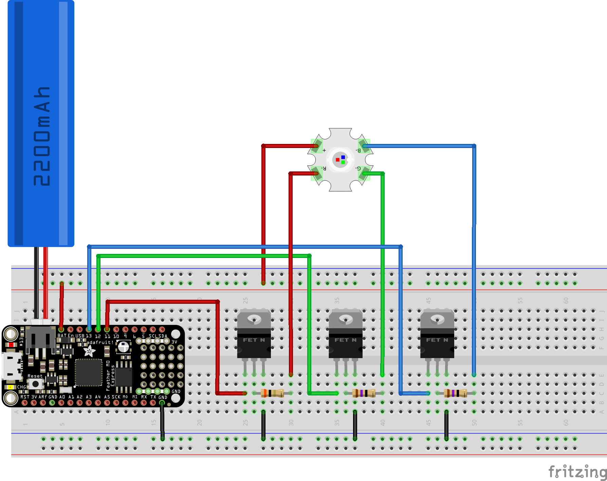

3W RGB LED hookup guide
=======================

Normally Adafruit has excellent hookup guides for all its parts, however all the guides for the [3W RGB LED](https://www.adafruit.com/product/2530) involve using the [Prop-Maker FeatherWing](https://www.adafruit.com/product/3988) (which includes various other features, such as an amplifier and accelerometer). This "Wing" is designed to fit together with one of their [Feather series boards](https://www.adafruit.com/category/835). So it's not so clear how to hookup the 3W RGB LED directly to any arbitrary MCU board.

However the schematics etc. (as with all Adafruit boards) are available on GitHub. The EagleCAD files are [here](https://github.com/adafruit/Adafruit-Prop-Maker-FeatherWing-PCB). I opened the schematic in EagleCAD, converted it to an SVG with [eagle2svg](http://eagle.autodesk.com/eagle/ulp?q[title_or_author_or_description_cont]=svg) (an Eagle ULP to covert schematics to SVG) and cut out the part of the schematic that supports connecting a 3W RGB LED. The result can be seen below.

The Prop-Maker FeatherWing uses a very simple circuit for controlling a 3W RGB LED. The 3 wires marked red, green and blue (on the left of the diagram) should be connected to PWM pins on your MCU board, the wire labeled V+ should be connected directly to your power source, typically a 3.7V LiPo battery (like [this](https://www.adafruit.com/product/1781)) and the four pads of your 3W RGB LED should be connected to the terminal marked as JP5 (1 to the LED's + terminal, 2 to R-, 3 to G- and 4 to B-).

The circuit itself just of a 100k&ohm; pull-down resistor for each PWM input followed by a [DMG3406](https://www.mouser.ch/ProductDetail/621-DMG3406L-7) MOSFET and a limiting resistor for the particular LED color that it controls. If you look at the [datasheet](https://cdn-shop.adafruit.com/product-files/2530/FD-3RGB-Y2.pdf) for the RGB LED you'll see that the forward voltage for red is 2.5V while it's 3.6V for green and blue, hence the different limiting resistors - 3&ohm; for red and 1.75&ohm; for green and blue.

As you can see in the schematic, the pull-down resistors are marked as 0603 and the limiting resistors are marked as 1206 - this means the 100k&ohm; resistors are 1/10 Watt SMD resistors while the 3&ohm; and 1.75&ohm; resistors are 1/4 Watt SMD resistors (see [resistor sizes and packages](http://www.resistorguide.com/resistor-sizes-and-packages/)).

If you look at the [Prop-Maker FeatherWing guide](https://learn.adafruit.com/adafruit-prop-maker-featherwing?view=all) you can clearly see this circuit in the guide's hi-resolution image of the top of the board:

The pull-down resistors are to the left, then the three pin MOSFETs, then the larger limiting resistors and finally pads for connecting the 3W RGB LED.

If you look at the [complete schematic](https://learn.adafruit.com/assets/69243) and the [logic pins section](https://learn.adafruit.com/adafruit-prop-maker-featherwing?view=all#logic-pins-2-5) of the guide, it's clear that you just connect the PWM inputs directly to pins on your MCU while V+ is connected either directly to your battery or to a pin on your MCU that provides the battery voltage directly (you should **not** attempt to power it off one of the logic pins on your MCU board, these can typically supply at most 40mA and will burn out trying to power a circuit like this).

Creating the 3W LED driver circuit with through-hole components
---------------------------------------------------------------

So as we can see the necessary circuit is very simple. Now let's look at how to reproduce it on a breadboard.

The following two Adafruit guides provide all the information we need:

* [Adafruit transistors 101](https://learn.adafruit.com/transistors-101?view=all) - in particular see the FETs section, the "How do I pick a transistor for the job?" section and the "Driving a LED Strip" example (using Darlington transistors).
* The usage section of the [RGB LED strips guide](https://learn.adafruit.com/rgb-led-strips?view=all#usage) - the examples here are better as they show using MOSFETs ([IRLB8721](https://www.adafruit.com/product/355)) as well as Darlington transistors ([TIP120](https://www.adafruit.com/product/976)).

The [Fritzing](https://fritzing.org/home/) file for this circuit is [here](3w-rgb-led-circuit.fzz).

Note: in the diagram above the 3W RGB LED is shown as if there were pins on the underside of the board, in reality you have to solder the resistors to each pad (or solder on jumper wires).

This circuit uses a 3.7V battery. This [Adafruit forum post](https://forums.adafruit.com/viewtopic.php?f=47&t=79083) covers using a 5V source and lists the different limiting resistors needed when using 5V (rather than 3.7V).

TODO: that post says you should use a 1W resistor for the red and 1/2W resistors for green and blue. So 5V is obviously higher than 3.7V but still this is quite a step up from the 1/4W resistors used on the Prop-Maker FeatherWing. Do you really need such high Wattage resistors and do I need higher than 1/4W resistors for my breadboard layout?

TODO: this circuit is essentially the same as the MOSFET example in the [RGB LED strips guide](https://learn.adafruit.com/rgb-led-strips?view=all#usage). Like that example, I don't use pull-down resistors on the PWM pins. Why does the Prop-Maker FeatherWing include them?

Alternatives
------------

The 3W RGB LED is US$3 and the MOSFETs and resistors add additional cost (the MOSFETs are $1.75 each from Adafruit but considerably cheaper at $0.85 from e.g. [Digikey](https://www.digikey.com/products/en?keywords=IRLB8721PBF) or [Mouser](https://www.mouser.com/ProductDetail/942-IRLB8721PBF)). And the resistors will have to be ordered from somewhere like Mourser or Digikey as these low Ohm resistors aren't carried by hobbyist sites like Adafruit or Sparkfun.

So this comes to a minimum of $3 + (3 x $0.85) + (3 x $0.10) = $5.85 (not including postage). You're not far off the $10 cost of the Prop-Maker FeatherWing (especially when you factor in your time and effort as a cost).

Another alternative is the [Adafruit Pixie](https://www.adafruit.com/product/2741) a 3W smart pixel with all necessary components built-in. At $15, it's considerably more expensive than building the circuit above but you save assembly time and the Pixie has additional useful features such as temperature cut-off.

---

* [1/4W 1.8&ohm; resistor](https://www.digikey.com/product-detail/en/yageo/CFR-25JB-52-1R8/1.8QBK-ND/154) - $0.10 - 1.8&ohm; is as close as you can get to 1.75&ohm; for through-hole resistors.
* [1/4W 3&ohm; resistor](https://www.digikey.com/product-detail/en/yageo/CFR-25JB-52-3R/3.0QBK-ND/1440) - $0.10

---

Lighthouse light - mark 2
=========================

* [Sparkfun 1/4 Watt resistor kit](https://www.sparkfun.com/products/10969)

* ULN2803A at [Adafruit](https://www.adafruit.com/product/970) / at [Mouser](https://www.mouser.ch/ProductDetail/511-ULN2803A)
